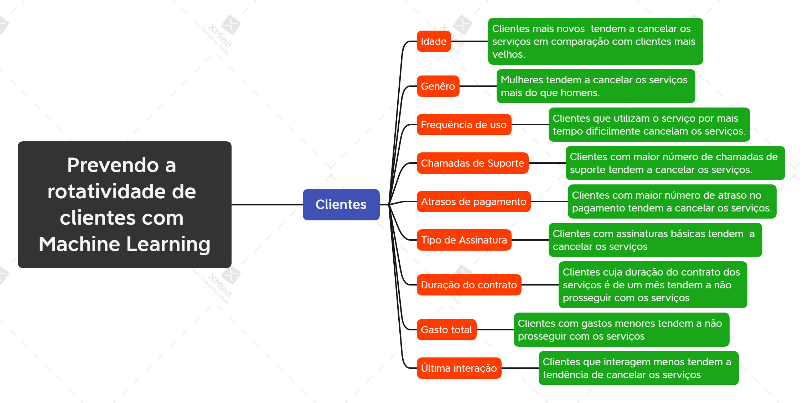
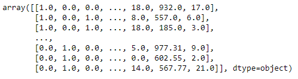
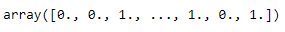
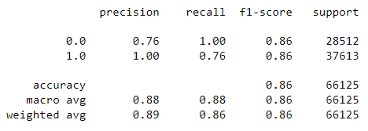
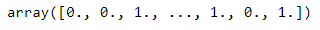
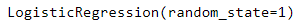
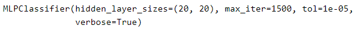
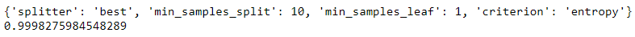
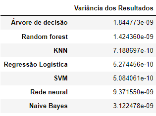

# Prevendo a rotatividade de clientes com Marchine-Learning

# 1. Introdução
   
  A rotatividade de clientes refere-se ao fenômeno em que os clientes descontinuam seu relacionamento ou assinatura com uma empresa ou provedor de serviços. Representa a taxa na qual os clientes param de usar os produtos ou serviços de uma empresa em um período específico. O churn é uma métrica importante para as empresas, pois afeta diretamente a receita, o crescimento e a retenção de clientes. No contexto do conjunto de dados Churn, o rótulo churn indica se um cliente cancelou ou não. Um cliente cancelado é aquele que decidiu descontinuar sua assinatura ou uso dos serviços da empresa. Por outro lado, um cliente não cancelado é aquele que continua engajado e mantém seu relacionamento com a empresa. Desse modo, a partir do conjunto de dados extraidos da plataforma [Kaggle](https://www.kaggle.com/datasets/muhammadshahidazeem/customer-churn-dataset), este projeto tem a finalidade de criar modelos preditivos para prever a rotatividade de clientes numa determinada empresa.

OBSERVAÇÃO: Caso não esteja conseguindo visualizar o arquivo do jupyter notebook aqui pelo Github, você pode acessar este link: (https://drive.google.com/file/d/1BxWARe6ZViO0tC2h1bUu2t6QLl-_TdLj/view?usp=sharing).

# 2. Objetivo

Construir modelos preditivo para prever a rotatividade de clientes numa determinada empresa. Ou seja, com base nas características dos clientes prever se eles irão cancelar ou não o serviço.

# 3. Justificativa
   
Entender a rotatividade de clientes é crucial para as empresas identificarem padrões, fatores e indicadores que contribuem para a perda de clientes. Ao analisar o comportamento do churn e seus recursos associados, as empresas podem desenvolver estratégias para reter os clientes existentes, melhorar a satisfação do cliente e reduzir a rotatividade de clientes. As técnicas de modelagem preditiva também podem ser aplicadas para prever e lidar proativamente com a rotatividade potencial, permitindo que as empresas tomem medidas proativas para reter clientes em risco.

# 4. Metodologia
   
Este é um projeto de data sciense and analyts, que envolve a utilização de modelos de machine leaning com objetivo de prever a rotatividade de clientes numa determinada empresa. É um projeto feito em python utilizando as bibliotecas do mesmo. Sendo assim, para alcançar o objetivo proposto, o primeiro passo é importar as bibliotecas do python necessárias  para construção do projeto. Em seguida, é feita a coleta dos dados. Logo após, uma análise dos dados inicial, com intuito de conhecer os dados e verificar possíveis inconsistências, tais como valores faltantes, valores inconsistentes, valores duplicados, presença de outliets, dentre outros. Depois, é feito a limpeza e o tratamento dos dados. Em seguida é realizado análise exploratória dos dados, com a finalidade de obter insigts para o time de negócios. Segue se a essa etapa a preparação dos dados para aprendizagem dos modelos de Marchine Learning. Com os dados já preparados é feito a aplicação dos Modelos de Machine Learning. Após isso, esses modelos passa por uma avaliação, em que é escolhidos os modelos que serão colocados em produção. Por fim, a última etapa é focada em traduzir o desempenho dos modelos escolhidos para métricas de negócios. Esse projeto se baseia um pouco no modelo Cross-Industry Standard Process for Data Mining (CRISP-DM), que é uma técnica que visa trabalhar em ciclos, fazendo com que possamos mapear e solucionar os problemas que possam existir no projeto. Desse modo, o projeto foi dividido da seguinte maneira:

#### 1. Introdução (Entendimento do Negócio)
- Tem por objetivo identifiar as demandas do time de negócio   
#### 2. Objetivo
- A partir da idenrificação das demandas do time de negócios traçar o objetivo do projeto.
#### 3. Justificativa
- O porque da realização do projeto.
#### 4. Metodologia
- Como será feito
#### 5.  Importação das bibliotecas utilizadas ao longo de todo o projeto
- Quais bibliotecas necessárias para rodar o projeto em python
#### 6.  Coleta de dados
- Onde se encontra os dados
#### 7. Verificando inconsistências nos dados
- Como os dados se apresentam
#### 8. Limpeza e Tratamento dos Dados
- Deixando os dados limpos 
#### 9. Análise Exploratória dos Dados: Obtendo insigts para o time de negócios
- Analisando o comportamento das variáveis para obter insigts time de negócios.
#### 10. Preparação dos dados para aprendizagem dos modelos de Marchine Learning
- Deixando os dados prontos para rodar os modelos de marchine learning.
#### 11. Aplicando os Modelos de Machine Learning
- Aplicando os modelos de marchine na base a base de dados.
#### 12. Avaliação dos algoritmos
- Avaliando o desempenho dos modelos e escolhendo o modelo que será colocado em produção.
#### 13. Traduzindo desempenho dos modelos escolhidos para métricas de negócios
- Traduzir o desempenho do modelo para métricas de negócios.

# 5. Coleta dos dados

Os dados foram extraidos da plataforma [Kaggle](https://www.kaggle.com/datasets/muhammadshahidazeem/customer-churn-dataset) Foi feio o downloard do arquivo em csv e importado para o jupyter notebook utilizando a biblioteca pandas. Após isso, foi feito um cópia desses dados.

# 6. Verificando inconsistências nos dados

## - Tamanhos dos dados
O conjunto de dados possui 440833 linhas e 12 colunas.
## - Tipo dos dados

## - Verificando existência de valores nulos

Todas as colunas possui 1 valor nulo. Cada valor nulo de cada coluna representa 0.000227% da mesma.
## - Verificando existência de valores inconsistentes
Não há valores inconsistentes na base de dados.
## - Verificando a existência de dados duplicados
Não há valores duplicados.
## - Conclusões
Foi dentificado os seguintes problemas:
* Em todas as colunas há um valor nulo.

# 7. Limpeza e Tratamento dos Dados

## - Tratando os valores faltantes
Foi feita a exclusão dos valores faltantes.
## - Detecção de outliers  com o Boxplot
 
## - Detecção de outliers com o algoritmo KNN
- Lista completa dos outliers para ser enviada para o setor responsável

# 8. Análise Exploratória dos Dados: Obtendo insigts para o time de negócios
## 8.1 Hipótese de Negócios
- Mapa Mental de Hipóteses

#### - Lista de Hipóteses:
   
**1**. Clientes mais novos tendem a cancelar os serviços em comparação com os clientes mais velhos.

**2**. Mulheres tendem a cancelar os serviços mais do que os homens.

**3**. Clientes que utilizam os serviços por mais tempo dificilmente cancelam.

**4**. Clientes com maior número de chamadas de suporte tendem a cancelar os serviços.

**5**. Clientes com maior número de atraso no pagamento tendem a cancelar os serviços.

**6**. Clientes com assinaturas básicas tendem a cancelar os serviços.

**7**. Clientes cuja duração do contrato é de um mês tendem a não prosseguir com os serviços.

**8**. Clientes que interagem menos tem a tendência de cancelar os serviços.

## 8.2  Análise Univariada
### 8.2.1 Distribuição da variável resposta
### -  Plotando um gráfico de distribuição normal

### - Executando o teste de Shapiro-Wilk para ver se a distribuição está normal

### 8.2.2 Separando as variáveis categóricas e númericas
#### - Variáveis númericas

#### - Variáveis categóricas

### 8.2.3 Analisando os atributos númericos
### -  Estatísticas Descritivas

### -  Distribuição das variáveis numéricas

## 8.3 Análise Bivariada - Validação de Hipóteses
### - H1: Clientes mais novos tendem a cancelar os serviços em comparação com os clientes mais velhos.
                                                    Quantidade de Churn por Idade

**FALSO**: Assumindo 0.0 (cancelou) 1.0 (não cancelou), os clientes mais velhos, a partir de 51 anos, cancelaram os serviços. Já clientes entre 30 e 50 anos não cancelaram. A maioria dos clientes entre 18 e 29 anos cancelaram os serviços.

### - H2: Mulheres tendem a cancelar os serviços mais do que os homens.
                                                    Quantidade de churn de acordo com o Gênero

**FALSO**: Assumindo 0.0 (cancelou) 1.0 (não cancelou), existem mais homens do que mulheres que cancelaram o serviço. Em contrapartida, existe mais mulheres do que homens que não cancelaram os serviços, embora com uma distância pequena. Com base nisso, é necessário entender os motivos que levaram mais pessoas do sexo masculino a cancelar os serviços e tomar medidas como forma de reter essas pessoas do sexo masculino.

### - H3: Clientes que utilizam os serviços por mais tempo dificilmente cancelam.
                                                   Quantidade de Churn por Frequência de uso

**FALSO**: Assumindo 0.0 (cancelou) 1.0 (não cancelou), dentre os clientes que possui maior frequência, a maioria cancelaram. Inclusive, em todas as frequência de uso que aparecem no gráfico, o número de clientes que cancelaram o serviço é maior do que o número de clientes que não cancelaram. Sendo assim, é necessário entender porque o número de cancelamentos é maior em todas as frequências de uso e tomar as medidas necessárias para contornar tal situação.

### - H4: Clientes com maior número de chamadas de suporte tendem a cancelar os serviços.
                                                Quantidade e Churn por Chamadas de suporte

**FALSO**: Assumindo 0.0 (cancelou) 1.0 (não cancelou), conforme o gráfico, dentre os clientes que possui maior número de suporte, isto é, número de chamada de suporte a partir de 6.0, não houve cancelamento.

### - H5: Clientes com maior número de atraso no pagamento tendem a cancelar os serviços.
                                              Quantidade de Churn por Atraso de pagamento

**FALSO**: Assumindo 0.0 (cancelou) 1.0 (não cancelou), não necessariamente, pois perceba pelo gráfico que os clientes com 21 atrasos em diante não cancelaram o serviço.

### - H6: Clientes com assinaturas básicas tendem a cancelar os serviços.
                                              Quantidade de Churn por Tipo de assinatura

**FALSO**: Assumindo 0.0 (cancelou) 1.0 (não cancelou), dentre os clientes que possuem assinaturas básicas, a maioria não cancelaram o serviço. O mesmo ocorre com clientes que possuem assinatura padrão e assinatura primium.

### - H7: Clientes cuja duração do contrato é de um mês tendem a não prosseguir com os serviços.
                                               Quantidade de Churn em relação a Duração do contrato

**FALSO**: Assumindo 0.0 (cancelou) 1.0 (não cancelou), dentre os clientes existentes na base de dados, todos que possuem contrato de um mês não cancelaram o serviço.

### - H8: Clientes que interagem menos tem a tendência de cancelar os serviços.
                                      Quantidade Churn por Última_interação

**VERDADEIRO**: Assumindo 0.0 (cancelou) 1.0 (não cancelou), conforme o gráfico, clientes cuja última interação vai de 1.0 a 15.0 cancelaram o serviço. Contudo, praticamente a mesma quantidade de clintes com essa mesma interação não cancelaram.

## 8.4 Análise Multivariada
### - Atributos numéricos

### - Correlação entre as variáveis númericas

### -  Atributos categóricos

### -  Correlação entre as variáveis categóricas

# 9. Preparação dos dados para aprendizagem dos modelos de Marchine Learning

## 9.1 Divisão entre atributos/previsores e classe
### - Visualizando as colunas

### - Separando as variaveis independentes

###  Separando a variavel dependente

## 9.2 Tratamento dos atributos categóricos (LabelEncoder, OneHotEncoder)

### - LabelEncoder
* Transforma os dados categóricos em dados númericos.
###### -  Visualizando os atributos numéricos após a aplicação do LabelEncoder
 
 
### - OneHotEncoder
###### - Visualizando registros categóricos trasnformados
 
 
## 9.3 Escalonamento dos Valores (padronizando utilizando o StandardScaler)
* Escalonamento de valores é deixá-los na mesma escala.
###### - Visualizando atributos numéricos já com os dados na mesma escala

## 9.4 Divisão da base em treinamento e teste
* Colocou somente 15% dos dados para testar e o restante, 85%, para treinar os algoritmos.
* Temos 374707 registros e 16 colunas para os atributos/caracteristicas e 374707 registros para a classe.
* Temos 374707 registros para treinar e 66125 para testar.
  
## 9.5 Salvando as variáveis com o pickle com os dados já tratados e divididos
* Após a preparação dos dados, eles são salvos.

# 10. Aplicando os Modelos de Machine Learning
**Algoritmos utilizados**

**1**. Naïve Bayes

**2**. Árvores de decisão

**3**. Random Forest

**4**. Aprendizagem baseada em instâncias - kNN

**5**. Regressão logística

**6**. Máquinas de Vetores de Suporte (SVM)

**7**. Redes Neurais

## 10.1 Naïve Bayes
### 10.1.1 Criando o algoritmo Naive Bayes e passando os dados de treino

* Esse algoritmo gera uma tabela de probabilidades.

### 10.1.2 Fazendo as previsões com os dados de teste

* Foi enviado para o algoritmo os 66125 registros que não foram utilizados no processo de treinamento.

### 10.1.3 Comparando com os dados reais de teste

* Perceba que o algoritmo acertou os três primeiros e os três últimos registros.

### 10.1.4  Avaliação do modelo

* Temos um percentual de acerto de 86,23%, o que indica que dos 66125 registros, o algoritmo acertou 86,23%.

* Assumindo 0.0 (cancelou) 1.0 (não cancelou), temos que, conforme a matriz de confusão, 28437 clientes que cancelaram o serviço de fato foram classificados como clientes que cancelaram. Ou seja, o algoritmo naive bayes acertou 28437 registros da classe 0.0. Ele errou 75 registros dessa classe, visto que ele classificou 75 pessoas que cancelaram o serviço como pessoas que não cancelaram.

* Para a classe 1.0 o algoritmo classificou 28584 clientes corretamente, visto que são clientes que não cancelaram o serviço e ele classificou como clientes que te fato cancelaram o serviço. Em contrapartida, ele classificou 9029 clientes que não cancelaram o serviço como clientes que cancelaram.

### 10.1.5 Relatório de classificação
* O relatório de classificação algumas métricas adicionais.
  

* No support temos 28512 clientes que cancelam o serviço e 37613 que não cancelam o serviço.

* O recall pode ser interpretado da seguinte maneira: O algoritmo consegue identificar corretamente 100% dos clientes que cancelam os serviços e quando o algoritmo identifica esse tipo de cliente ele tem uma precisão de acerto de 76%. Por outro lado, o algoritmo consegue indentificar corretamente 76% dos clientes que não cancelam os serviços e quando ele identifica esse de cliente ele está correto em 100% dos casos.

## 10.2 Árvores de decisão
### 10.2.1 Criando o algoritmo Árvores de decisão e passando os dados de treino

### 10.2.2 Fazendo as previsões com os dados de teste

### 10.2.3 Comparando com os dados reais de teste

### 10.2.4 Avaliação do modelo

* A árvore de decisão um percentual de acerto de 99,99%, o que indica que dos 66125 registros, o algoritmo acertou 99,99%%, o que é uma performace muito boa e bem melhor do que o algoritmo naive bayes.

* Assumindo 0.0 (cancelou) 1.0 (não cancelou), temos que, conforme a matriz de confusão, 28509 clientes que cancelaram o serviço de fato foram classificados como clientes que cancelaram. Ou seja, o algoritmo árvore de decisão acertou 28509 registros da classe 0.0. Ele errou somente 3 registros dessa classe, visto que ele classificou apenas 3 pessoas que cancelaram o serviço como pessoas que não cancelaram.

* Para a classe 1.0 o algoritmo classificou 37610 clientes corretamente, visto que são clientes que não cancelaram o serviço e ele classificou como clientes que te fato não cancelaram o serviço. Em contrapartida, ele classificou somente 3 clientes que não cancelaram o serviço como clientes que cancelaram.

### 10.2.5 Relatório de classificação

* No support temos 28512 clientes que cancelam o serviço e 37613 que não cancelam o serviço.

* Conforme o recall, algoritmo consegue identificar corretamente 100% dos clientes que cancelam os serviços e quando o ele identifica esse tipo de cliente ele tem uma precisão de acerto de 100%. Por outro lado, o algoritmo consegue indentificar corretamente 100% dos clientes que não cancelam os serviços e quando ele identifica esse de cliente ele está correto em 100% dos casos. Ou seja, é uma performance muito boa do algoritmo árvore de decisão.

## 10.3 Random Forest
### 10.3.1 Criando o algoritmo Random Forest e passando os dados de treino

### 10.3.2 Fazendo as previsões com os dados de teste

### 10.3.3 Comparando com os dados reais de teste

### 10.3.4 Avaliação do modelo

Resultado do score conforme o número de árvores de decisão:

* 99,93% com 10 árvores de decisão.
* 99,95% com 20,25 e 35 árvores de decisão.
* 99,96% com 40,50,60 árvores de decisão.

* O Random Forest teve um percentual de acerto de 99,96%, o que indica que dos 66125 registros, o algoritmo acertou 99,96%, o que é uma performace muito boa. É melhor do que o algoritmo naive bayes, mas perde para a árvore de decisão individual.

* Assumindo 0.0 (cancelou) 1.0 (não cancelou), temos que, conforme a matriz de confusão, 28491 clientes que cancelaram o serviço de fato foram classificados como clientes que cancelaram. Ou seja, o algoritmo random forest acertou 28491 registros da classe 0.0. Ele errou somente 21 registros dessa classe, visto que ele classificou apenas 21 pessoas que cancelaram o serviço como pessoas que não cancelaram.

* Para a classe 1.0 o algoritmo classificou 37609 clientes corretamente, visto que são clientes que não cancelaram o serviço e ele classificou como clientes que te fato não cancelaram o serviço. Em contrapartida, ele classificou somente 4 clientes que não cancelaram o serviço como clientes que cancelaram.

### 10.3.5 Relatório de classificação

* No support temos 28512 clientes que cancelam o serviço e 37613 que não cancelam o serviço.

* Conforme o recall, algoritmo consegue identificar corretamente 100% dos clientes que cancelam os serviços e quando o ele identifica esse tipo de cliente ele tem uma precisão de acerto de 100%. Por outro lado, o algoritmo consegue indentificar corretamente 100% dos clientes que não cancelam os serviços e quando ele identifica esse de cliente ele está correto em 100% dos casos. Ou seja, é uma performance muito boa do algoritmo random forest.

## 10.4 Aprendizagem baseada em Instâncias - KNN
### 10.4.1 Criando o algoritmo KNN e passando os dados de treino

### 10.4.2 Fazendo as previsões com os dados de teste

### 10.4.3 Comparando com os dados reais de teste

### 10.4.4 Avaliação do modelo

* O algoritmo KNN teve um percentual de acerto de 98,71%, o que indica que dos 66125 registros, o algoritmo acertou 98,71%, o que é uma performace muito boa. É melhor do que o algoritmo naive bayes, mas perde para a árvore de decisão individual e para o random forest.

* Assumindo 0.0 (cancelou) 1.0 (não cancelou), temos que, conforme a matriz de confusão, 28328 clientes que cancelaram o serviço de fato foram classificados como clientes que cancelaram. Ou seja, o algoritmo random forest acertou 28328 registros da classe 0.0. Porém, ele errou somente 184 registros dessa classe, visto que ele classificou 184 pessoas que cancelaram o serviço como pessoas que não cancelaram.

* Para a classe 1.0 o algoritmo classificou 36948 clientes corretamente, visto que são clientes que não cancelaram o serviço e ele classificou como clientes que te fato não cancelaram o serviço. Em contrapartida, ele classificou 665 clientes que não cancelaram o serviço como clientes que cancelaram, o que é um número de erros bastante considerável.

### 10.4.5 Relatório de classificação

* No support temos 28512 clientes que cancelam o serviço e 37613 que não cancelam o serviço.

* Conforme o recall, algoritmo consegue identificar corretamente 99% dos clientes que cancelam os serviços e quando ele identifica esse tipo de cliente ele tem uma precisão de acerto de 98%. Por outro lado, o algoritmo consegue indentificar corretamente 98% dos clientes que não cancelam os serviços e quando ele identifica esse de cliente ele está correto em 100% dos casos.

## 10.5 Regressão logística
### 10.5.1 Criando o algoritmo Regressão logística e passando os dados de treino

### 10.5.2 Fazendo as previsões com os dados de teste

### 10.5.3 Comparando com os dados reais de teste

### 10.5.4 Avaliação do modelo

* A regressão logística teve um percentual de acerto de 97,89%, o que indica que dos 66125 registros, o algoritmo acertou 97,89%. É melhor do que o algoritmo naive bayes, mas perde para a árvore de decisão individual, para o random forest e para o KNN.

* Assumindo 0.0 (cancelou) 1.0 (não cancelou), temos que, conforme a matriz de confusão, 27869 clientes que cancelaram o serviço de fato foram classificados como clientes que cancelaram. Ou seja, a regressão logística acertou 27869 registros da classe 0.0. Porém, errou somente 643 registros dessa classe, visto que ele classificou 643 pessoas que cancelaram o serviço como pessoas que não cancelaram, o que é um erro bastante considerável.

* Para a classe 1.0 o algoritmo classificou 36867 clientes corretamente, visto que são clientes que não cancelaram o serviço e ele classificou como clientes que te fato não cancelaram o serviço. Em contrapartida, ele classificou 746 clientes que não cancelaram o serviço como clientes que cancelaram, o que é um número de erros bastante considerável.

### 10.5.5 Relatório de classificação

* No support temos 28512 clientes que cancelam o serviço e 37613 que não cancelam o serviço.

* Conforme o recall, a regressão logística consegue identificar corretamente 99% dos clientes que cancelam os serviços e quando ela identifica esse tipo de cliente a precisão de acerto é de 97%. Por outro lado, o algoritmo consegue indentificar corretamente 98% dos clientes que não cancelam os serviços e quando ele identifica esse de cliente ele está correto em 98% dos casos.

## 10.6 Máquinas de Vetores de Suporte (SVM)
### 10.6.1 Criando o algoritmo Regressão logística e passando os dados de treino

### 10.6.2 Fazendo as previsões com os dados de teste

### 10.6.3 Comparando com os dados reais de teste

### 10.6.4 Avaliação do modelo

* O algoritmo SVM teve um percentual de acerto de 99,32%, o que indica que dos 66125 registros, o algoritmo acertou 99,32%. É melhor do que o algoritmo naive bayes, KNN e regressão logística, mas perde para a árvore de decisão individual e para o random forest.

* Assumindo 0.0 (cancelou) 1.0 (não cancelou), temos que, conforme a matriz de confusão, 28240 clientes que cancelaram o serviço de fato foram classificados como clientes que cancelaram. Ou seja, o algoritmo SVM acertou 28240 registros da classe 0.0. Porém, errou 272 registros dessa classe, visto que ele classificou 272 pessoas que cancelaram o serviço como pessoas que não cancelaram, o que é um erro bastante considerável.

* Para a classe 1.0 o algoritmo classificou 37441 clientes corretamente, visto que são clientes que não cancelaram o serviço e ele classificou como clientes que te fato não cancelaram o serviço. Em contrapartida, ele classificou 172 clientes que não cancelaram o serviço como clientes que cancelaram, o que é um número de erros bastante considerável.

### 10.6.5 Relatório de classificação

* No support temos 28512 clientes que cancelam o serviço e 37613 que não cancelam o serviço.

* Conforme o recall, o algoritmo SVM consegue identificar corretamente 99% dos clientes que cancelam os serviços e quando ela identifica esse tipo de cliente a precisão de acerto é de 99%. Por outro lado, o algoritmo consegue indentificar corretamente 100% dos clientes que não cancelam os serviços e quando ele identifica esse de cliente ele está correto em 99% dos casos.

## 10.7 Redes Neurais
### 10.7.1 Criando o algoritmo Redes Neurais e passando os dados de treino

### 10.7.2 Fazendo as previsões com os dados de teste

### 10.7.3 Comparando com os dados reais de teste

### 10.7.4 Avaliação do modelo

* A rede neural teve um percentual de acerto de 99,93%, o que indica que dos 66125 registros, o algoritmo acertou 99,94%. Só perde para árvore de decisão e para o random forest.

* Assumindo 0.0 (cancelou) 1.0 (não cancelou), temos que, conforme a matriz de confusão, 28494 clientes que cancelaram o serviço de fato foram classificados como clientes que cancelaram. Ou seja, a rede neural acertou 28494 registros da classe 0.0. Porém, errou somente 18 registros dessa classe, visto que ele classificou 18 pessoas que cancelaram o serviço como pessoas que não cancelaram.

* Para a classe 1.0 o algoritmo classificou 37611 clientes corretamente, visto que são clientes que não cancelaram o serviço e ele classificou como clientes que te fato não cancelaram o serviço. Em contrapartida, ele classificou apenas 2 clientes que não cancelaram o serviço como clientes que cancelaram.

### 10.7.5 Relatório de classificação

* No support temos 28512 clientes que cancelam o serviço e 37613 que não cancelam o serviço.

* Conforme o recall, algoritmo consegue identificar corretamente 100% dos clientes que cancelam os serviços e quando o ele identifica esse tipo de cliente ele tem uma precisão de acerto de 100%. Por outro lado, o algoritmo consegue indentificar corretamente 100% dos clientes que não cancelam os serviços e quando ele identifica esse de cliente ele está correto em 100% dos casos. Ou seja, é uma performance muito boa da rede neural.

# 11. Avaliação dos algoritmos
## 11.1 Performance dos Algoritmos

## 11.2 Ajuste (Tuning) dos parâmetros com RandomizedSearchCV e Validação Cruzada
> * Existem três estratégias para encontrar o conjunto de parâmetros que maximiza a aprendizagem do modelo: 

**1**. **Random Search**: Define os valores para cada um dos parâmetros de forma aleatória. Uma das vantagens é que ele mais rápido se comparado com as outras técnicas. Porém, dentre as desvantagens está o fato de que ele acaba selecionando o mesmo conjunto de valores que já foi testado em outra interação. Além disso, uma outra desvantagem é que ele pode nunca conseguir encontrar o melhor conjunto de valores que maximiza a aprendizagem do modelo, porque como a pesquisa é aleatória pode ser que por causa dessa aleatoriedade ele não encontre o melhor conjunto de parâmetros.

**2**. **Grid Search**: Define todas as combinações possíveis de valores que os parâmetros podem assumir. A vantagem é que ele realmente consegue encontrar o melhor conjunto de valores para cada um dos parâmetros que maximiza o modelo e, caso ele não encontre, fica próximo disso. Contudo, pelo fato de ele buscar fazer todas as combinações possíveis, demora muito tempo.

**3**. **Bayesian**: Define os valores dos parâmetros seguindo a teoria de Bayes. Ele busca encontrar o melhor conjunto de parâmetros baseado na aprendizagem anterior. Ele não faz nada aleatório como o Random Search e também não testa todas as possibilidades como o Grid Search, mas busca encontrar o melhor conjunto baseado na aprendizagem anterior. Ele é mais rápido do que o Grid Search, porém é mais lento do que o Random Search. 

* Por ser mais rápido que os demais, utilizei o Random Search. Porém, obtive êxito somente na árvore de decisão, random forest, redes neurais e regressão logística. Nos demais algoritmos, mesmo rodando o códigos tanto pelo jupyter notebook na minha máquina pessoal quanto pelo google colab, foi demorado e não saiu o resultado. Por isso, decidir prosseguir com a implementação da validação cruzada sem fazer o ajuste de parâmetros nesses algoritmos.

*  A validação cruzada consiste em fazer a divisão da base de dados utilizando vários pedaços/partes para treinamento e um pedaço para teste.

### 11.2.1 Visualizando tamanho da base de treinamento e da base de teste

* Ou seja, anteriormente estávamos trabalhando com 374707 registros para treinar o algoritmo e 66125 para testar. Tínhamos isso quando estávamos trabalhando com a divisão das bases de dados, isto é, uma parte dos dados para treinar e a outra parte para testar.

* Contudo, na validação cruzada nós utilizamos a base de dados inteira, não utilizamos essa divisão, pois durante o processo de validação cruzada o próprio algoritmo vai fazer as quebras/divisões da base de dados. Então o que vamos precisar fazer agora é concatenar essas duas variáveis (treinamento e teste) para termos a base de dados completa.

### 11.2.2 Juntando as bases de treino e teste

* Perceba que agora temos os 440832 registros na mesma variável.

### 11.2.3 Aplicação do RandomizedSearchCV para descobrirmos os melhores parâmetros para cada um dos algoritmos
### - Árvore de decisão

* Temos uma taxa de acerto de 99,98%, anterioremente 99,99%. Isso significa que houve uma pequena piora nos resultados por meio dos parâmetros acima, isto é, {'splitter': 'best', 'min_samples_split': 10, 'min_samples_leaf': 1, 'criterion': 'entropy'}.

### - Random forest

* O resultado da taxa de precisão foi de 98,95%. Anteriormente tinha sido 98.40. Tivemos uma pequena melhora.

* Os parâmetros utilizados foram {'n_estimators': 40, 'min_samples_split': 10, 'min_samples_leaf': 1, 'criterion': 'gini'}.

### - Redes Neurais

* A melhor combinação de parâmetros encontrado pelo algoritmo foi {'solver': 'adam', 'batch_size': 56, 'activation': 'relu'}

* Essa combinação levou a um resultado de 99,89%, antes tinha sido 99,96%. Ou seja, houve uma pequena dimiuição dos resultados com a combinação de parâmetros acima.

### - Máquinas de Vetores de Suporte (SVM)
* Demorou muito para rodar e no fim acabou não gerando os parâmetros.

### -  Aprendizagem baseada em Instâncias (KNN)
* Demorou muito para rodar e no fim acabou não gerando os parâmetros.

### -  Regressão Logística

* A melhor combinação de parâmetros encontrado pelo algoritmo foi {'tol': 1e-05, 'solver': 'saga', 'C': 1.0}.

* Essa combinação levou a um resultado de 98,06%, antes tinha sido 97,89%. Ou seja, houve uma pequena melhora com a combinação de parâmetros acima.

### 11.2.4 Visualização dos resultados após a implementação da Validação Cruzada 

* Temos todos os 5 testes com os valores da taxa de acerto de cada algoritmo.

### - Variância dos resultados

### - Coeficiente de Variação dos resultados

* O coeficiente mostra a variação desses dados no formato de probabilidade.

* Note que a rede neural tem a menor variação dos dados, seguido da regressão logística. Exatamente o mesmo resultado do desvio padrão, só que de uma maneira mais fácil de interpretar. Note que o Random forest tem uma maior variação dos dados, pois possui o maior coeficiente de variação, seguido da árvore de decisão simples.

## 11.3 Teste de normalidade nos resultados
* O objetivo dos testes estatísticos é saber se um algoritmo é melhor do que outro.

* Desse modo, vamos fazer testes estatísticos, e esses conceitos são muito importantes caso você queira colocar um novo modelo em produção para uma empresa. Você precisa ter a certeza que um algoritmo é melhor do que outro para você fazer a escolha certa. E também, caso for fazer artígos científicos que você queira fazer testes com algoritmos você precisa provar estatísticamente que um algoritmo é melhor do que o outro. Ou seja, vamos supor que você inventou um novo algoritmo e quer provar que ele é melhor do que os algoritmos já existentes e a maneira de fazer isso é utilizando os testes estatísticos.

* Para aplicar o teste de hipótese obrigatoriamente os dados precisam estar em uma distribuição normal.

### 11.3.1 Teste de Shapiro
* Shapiro: https://en.wikipedia.org/wiki/Shapiro%E2%80%93Wilk_test

* A função retorna dois valores e o que nos interessa é o valor de p que está no segundo parâmetro.

* Se o p-value <= alpha, indica que os dados não são normais. A hipótese nula indica que os dados estão na distribuição normal e a hipótes e alternativa indica que os dados não estão em uma distribuição normal.

* Sendo assim, o p-value de todos os algorítmos não é menor ou igual ao alpha. Indica que nós aceitamos a hipótese nula. Em outras palavras todos esses dados estão na distribuição normal.

### 11.3.2 Visualizando as distribuições dos resultados dos algoritmos

#### - Distribuição dos resultados da Árvore de Decisão

#### - Distribuição dos resultados do Random Forest

#### - Distribuição dos resultados da Rede Neural

#### - Distribuição dos resultados  do algoritmo Máquinas de Vetores de Suporte (SVM)

#### - Distribuição dos resultados do algoritmo Naive Bayes

#### - Distribuição dos resultados da Aprendizagem baseada em Instâncias (KNN)

#### - Distribuição dos resultados da Regressão Logística

### 11.3.3 Teste de hipótese com ANOVA e Tukey
* Esse teste pode ser aplicado quando temos dados que estão em uma distribuição normal. Segundo o teste de Shapiro, todos os resultados de todos os algoritmos estão numa distribuição normal.

#### - Aplicação do Teste Anova
* O teste Anova nesse nosso contexto vai nos ajudar a decidirmos se os resultados são diferentes, pois temos um conjunto com alguns algoritmos e precisamos primeiramente indicar se existe uma difereça estatística entre eles.

* Temos um valor em notação científica. Isso significa que rejeitamos a hipóse nula, portanto há diferença significativa entre os resultados dos algoritmos. Ou seja, quer dizer que os resultados das redes neurais é diferente do que os resultados do random forest, diferente do resultado da regressão logística e, assim, por diante.

* E chegando a conclusão de que os dados são diferentes, podemos fazer a aplicação de um outro teste que é o teste Tukey para verificar qual é o melhor algoritmo. Se a hipótese nula fosse aceita, ou seja, os resultados dos algoritmos fossem iguais não havendo diferença estatística entre ele, poderíamos chegar a conclusão que tanto faz utilizar qualquer um dos algoritmos, ou seja, tanto faz utilizar a rede neural, ou árvore de decisão, ou regressão logística e, assim, por diante. Contudo, como há diferença estatística entre os resultados dos algoritmos, precisamos verificar qual é o melhor algoritmo.

#### - Aplicação do Teste Tukey

###### - Média de acerto dos algoritmos

* Podemos observar o valor de p(p-adj) e temos o valor de alpha que é 0,05.

* Para fazermos a análise seguimos a mesma lógica que nós vimos anteriormente.

* Temos a comparação da árvore com o KNN, o valor de p é 0.0. Se o valor de p < alpha nós rejeitamos a hipótese nula o que indica que o resultado dos algoritmos são diferentes.

* Temos o valor True em todos eles (na coluna reject), isto é, rejeita a hipótese nula, o que indica que todos os algoritmos são diferentes. Por exemplo, temos que o resultado da melhor média foi da árvore de decisão. O resultado entre a árvore de decisão e o random forest  possui diferença estatística. Em outras palavras podemos provar que o algoritmo árvore de decisão é estatísticamente superior ao algoritmo random forest que ficou sem segundo lugar. Com isso caso você queira decidir o melhor algoritmo para você aplicar em um ambiente comercial, podemos utilizar a árvore de decisão, pois ela é estatísticamnete superior a todos os outros.

* Se tivessemos o valor false entre dois algoritmos, significaria que esses dois algoritmos não seria estatísticamente diferentes.

* Neste caso, podemos chegar a conclusão que a árvore de decisão é estatísticamente superior a todos os outros algoritmos e caso formos escolher somente um algoritmo ele deve ser o algoritmo escolhido, pois é estatísticamente superior aos outros.

###### - Visualizando os resultados através de um gráfico

* Perceba que a naive bayes está bem atrás dos outros com pior resultado.

* Em primeiro lugar com o melhor resultado aparece árvore de decisão, seguido do random forest e da rede neural.

### 11.4 Salvando e Carregando um classificador já treinado
#### 11.4.1 Salvando um classificador já treinado

#### 11.4.2 Carregar um classificador já treinado

### 11.5 Combinação e Rejeição de classificadores
#### 11.5.1 Combinação de classificadores

#### 11.5.2 Rejeição de classificadores

# 12. Traduzindo desempenho dos modelos escolhidos para métricas de negócios
Existem duas maneiras de verificar o impacto de um modelo preditivo sobre o negócio, ou seja, o quanto esse modelo trará de retorno para a empresa, seja retorno financeiro através do através do incremento de receitas ou redução de custos, seja pela diminição no tempo de determinado processo, contribuindo para o aumento da produtividade, dentre outros. 

**1**. **A primeira maneira é comparar a performance do modelo de marchine learning com as métricas já utilizadas pela empresa**:

* Existem empresas que possuem seus modelos de previsão seja de receitas, de vendas, de clientes, dentre outros, uma vez que as elas se baseiam em dados futuros para planejar sua operação. Sendo assim, uma alternativa é comparar a performance do modelo já utilizado na empresa com o modelo de marchine learning e, assim, constatar se com o modelo de marchine learning há um menor erro nas previsões em comparação com o modelo existente na empresa, se a acurácia é melhor, se com esse modelo a empresa pode evitar desperdícios etc.

**2**. **Uma outra maneira é através do próprio modelo de marchine learning verificar o incremento que o modelo trás para o negócio, seja incremento de receita, redução de custo, redução de tempo, perda de clientes, dentre outros.**:

* O modelo que teve o melhor desepenho neste projeto foi a árvore de decisão, seguido do random forest e da rede neural. Se pegarmos as previsões da árvore de decisão por exemplo e do total previsto verificarmos a quantidade de clientes que cancelará o serviço, e somarmos o gasto_total de todos esse clientes que cancelará o serviço, teremos o quanto a empresa pode perder de receita. Sendo assim com a aplicação desse modelo, a empresa ao conseguir prever quais clientes irá cancelar o serviço, poderá tomar medidas visando perder o mínimo de clientes possíveis e, assim, diminiuir os prejuízos de vendas/receitas.

* Por exemplo, tomando como base a performance da árvore de decisão, considerando a divisão dos dados em treino e teste, conforme a matriz de confusão, assumindo 0.0 (cancelou) 1.0 (não cancelou), temos que, 28509 clientes que cancelaram o serviço de fato foram classificados como clientes que cancelaram. Ou seja, o algoritmo árvore de decisão acertou 28509 registros da classe 0.0. Ele errou somente 3 registros dessa classe, visto que ele classificou apenas 3 pessoas que cancelaram o serviço como pessoas que não cancelaram. Sendo assim, somando o gasto_total desses 28509 clientes temos o valor que a empresa deixou de arrecadar. 

  
